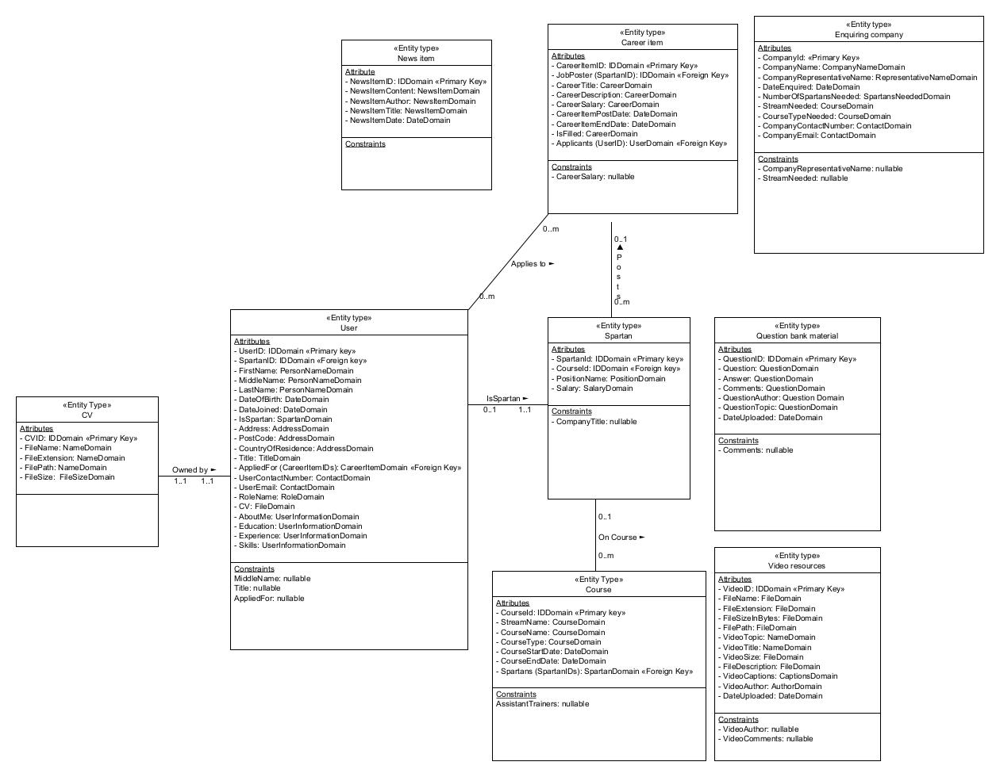

# SpartaSiteWebApp_API

## Intent of Project

-  This project will be made up of two part: an API that, allows CRUD operations on all the necessaryinformation(displayed in JSON), that would be stored and used for an all-in-one sparta site; and an MVC that uses the API to produce an appropriate series of web pages for a traditional user. This isn't endorsed by Sparta Global and is purely an exercise for my learning.

## Contents of Project

- Currently I have the [SpartaSiteAPI](https://github.com/MHandley10/SpartaSiteWebApp_API/tree/main/SpartaSiteAPI)solution. This isn't operable at the moment, however, shall have controllers and repositories to allow a user to perform CRUD operations on the data.

- The [ERDForSpartanSite](https://github.com/MHandley10/SpartaSiteWebApp_API/blob/main/ERD/ERDForSpartanSite.uxf) is my attempt at an entity relationship diagram for the API and MVC to provide some structure to the data classes and dbContext. This is a working document and will change as the data does. To make this item I used [Umlet](https://www.umlet.com/), a free tool for creating UML diagrams. You can access this File by downloading it and then opening it using Umlet, or another UML diagram creation tool. I have included an image of the ERD below.

## Notes & Currently working on

- Creating controllers to allow CRUD operations.

## Author

- Created by Matthew Handley (MHandley10/Unloosedcascade). If you are interested in this project please feel free to contact me on my [LinkedIn](https://www.linkedin.com/in/matthew-handley12)